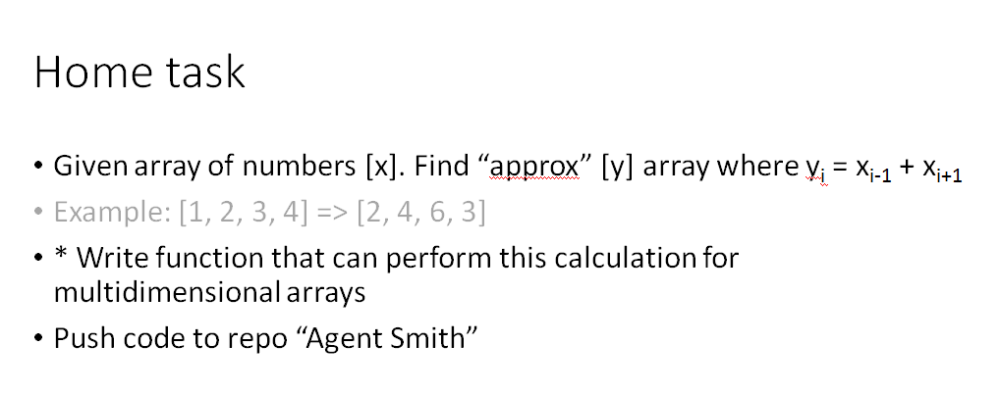

### Run app
```sh
node index.js
```

### Examples
```sh
const array = [1, 8, 2, 5]; //[8, 3, 13, 2]
const array = [
  [7, 8, 0, 4], //[10,15,16,5]
  [2, 8, 4, 5], //[16,14,15,11]
  [1, 0, 2, 3]  //[2,11,7,7]
];
```