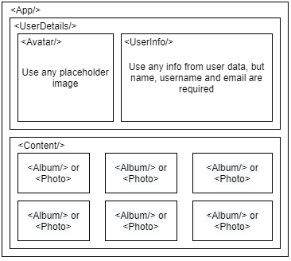

# React Task 1

You need to implement simple page with information about user.
The user has next data and should be stored as constant variable and passed as props into application:

```sh
{
    "id": 1,
    "name": "Leanne Graham",
    "username": "Bret",
    "avatarSrc":"img_girl.jpg",
    "email": "Sincere@april.biz",
    "address": {
      "street": "Kulas Light",
      "suite": "Apt. 556",
      "city": "Gwenborough",
      "zipcode": "92998-3874",
      "geo": {
        "lat": "-37.3159",
        "lng": "81.1496"
      }
    },
    "phone": "1-770-736-8031 x56442",
    "website": "hildegard.org",
    "company": {
      "name": "Romaguera-Crona",
      "catchPhrase": "Multi-layered client-server neural-net",
      "bs": "harness real-time e-markets"
    }
  }
```

You are free to implement different design (discuss it with mentors), but UX should be the following:


# React Task 2
You have to create request for albums data from https://jsonplaceholder.typicode.com/ and paste this information into you application inside <Content/> component from previous task.
So UX should be next: 


No any strict rules for UI or UX, but you need paste this data like list items
Don’t use react hooks for this task (only classes available if you need side effects)

 
# React Task 3
You have to implement next things
1.	Rewrite classed components to functional components with hooks
2.	Add logic for clicking on album: you should load all photos from album and paste it into <Content/> component. 

So UX should be next: 
1.	Initial you load albums and paste it into <Content/> (it has to be done in previous task)
2.	After it you can click on album and load photos
3.	there is should be back button to go back to albums in case if you are on “photos” page (fells free to choose place for it)

